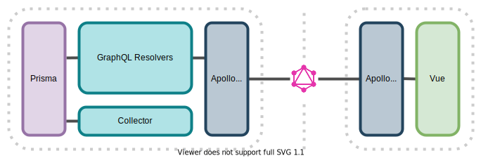

# Technology Stack

DripDash is a combination of two main units:
* DripDash server - a data logging and viewing API.
* DripDash client - a web app for monitoring and controlling devices.

The two halves are linked with the DripDash GraphQL [API](API.md).



## DripDash Server

DripDash server runs on Node. The resolvers implement the application logic and connect the Apollo GraphQL server to Prisma.

As most of the devices reporting to DripDash support a REST API (instead of a GraphQL one). The collector implements a bare-bones REST API at `/collect` to take data packets from the devices and funnel them into Prisma.

At the core of the server is an Express instance, which serves Apollo at `/api` and the Collector at `/collect`. Furthermore, Express serves the Vue app at `/`.

```javascript
api.applyMiddleware({ app, path: "/api" });
app.use("/collect", collector);

// Serve the Vue app (with history mode).
app.use(history());
app.use(express.static(publicPath, staticConf));

app.listen(PORT, () => console.log(`🚀 DripDash server running at http://localhost:${PORT}`));
```

### Prisma

Prisma is somewhat like a simplified ORM. It allows querying of the database by calling functions and methods on methods, instead of writing SQL.

The database tables and linked objects in prisma are defined in `prisma/schema.prisma`.

#### Schema

For those familiar with GraphQL, Prisma's schema follows a similar syntax.

```prisma
model Device {
  id          String      @id
  name        String?
  owner       User        @relation(fields: [ownerId], references: [id])
  ownerId     Int
  groups      Group[]
  latitude    Float?
  longitude   Float?
  data        DataEntry[]
}
```
For more information about the Prisma schema, check out [the schema docs](https://www.prisma.io/docs/reference/tools-and-interfaces/prisma-schema).

#### Migrations

Instead of constructing the database tables ourselves, we let Prisma read it's own schema and construct the required tables. Prisma also takes care of link tables for Many-to-Many relations.

Converting the Prisma schema to database tables is called a [migration](https://www.prisma.io/docs/reference/tools-and-interfaces/prisma-migrate) by Prisma. Further changes to the schema create successive migrations that allow the database to evolve or be rolled back.

```bash
# Save the current state of the schema as a migration,
# and generate the steps required to carry out this change:
prisma migrate save --experimental

# Execute any migrations which are yet to be run on the database:
prisma migrate up --experimental
```
> Note: the `--experimental` flag will not be required in the future.

#### Prisma in DripDash

Within DripDash, Prisma is imported wherever a database connetion is needed, and queries can be carried out against it.

```javascript
const { PrismaClient } = require("@prisma/client");
const prisma = new PrismaClient();

// ...

const device = await prisma.device.findOne({
  where: { id: req.params.id }
});
```

Prisma should be used asynchronously with `await` to avoid blocking the thread.

### Apollo

Apollo is a GraphQL server with some nice-to-have features, such as request batching.

The schema served by Apollo is defined in `server/schema.graphql`, and follows the [GraphQL syntax](https://graphql.org/learn/schema/). Each request must either be a mutation or a query.

#### Schema

The schema defines:
* What queries are available to request data.
* What mutations are available to change data.
* What fields can be requested from each type.

All valid queries must start from the `query` block, and can request fields and subfields of the types available within the query block.

All valid mutations must start from the `mutations` block. The parameters marked with `!` are mandatory, all others are optional. Mutations return a `type`, of which fields can be requested. Usually, you must request at least one field of the returned type, typically the ID.

#### Resolvers

Apollo calls resolvers to fill the fields requested by the client query. Resolvers call data from the database via Prisma and return the fields required.

```javascript
const Query = {
  self: async (_, {}, ctx) => {
    if (!ctx.user) return null;
    const a =  await prisma.user.findOne({
      where: {
        id: ctx.user.id
      }
    });
    return a;
  },
  // ...
}
```

You may notice a resolver for a type does not usually bother to return fields with primitive types. This is because the Apollo Server is smart enough to [auto-fill these fields](https://www.apollographql.com/docs/apollo-server/data/resolvers/#default-resolvers). Other types need to be explicitly resolved.

### Collector

The DripDash Collector is a simple Express endpoint, at `/collect`.

The collector could theoretically be run without the main server, to allow data to be collected even when the Vue app is offline, but there is minimal use for this in practice.

## DripDash Client

DripDash server is a Vue app, that uses the Apollo client to provide polled access to the server's GraphQL API.

### Vue

Vue is a web framework for building responsive web applications.
The application is built out of a series of single-file components that contain their own scripts, markup and styling. These components live at `src/components`.

DripDash also makes use of:
* Vue Router - a method of replacing components depending on the URL the user navigates to.
* VueX - a global state store, for scripts and data which need to be accessed by many components, such as the user's authentication state.


### Apollo Client

Apollo Client manages the connection to the API, and provides a neat interface for getting live-reloaded data within Vue components.

Apollo is used within components:
* Manually using `this.$apollo` to construct queries or mutations
* Using the `apollo: {}` object within the component to create
  smart queries, which are cached and automatically updated to
  populate the component.
